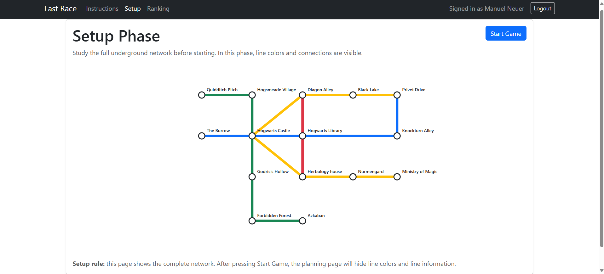
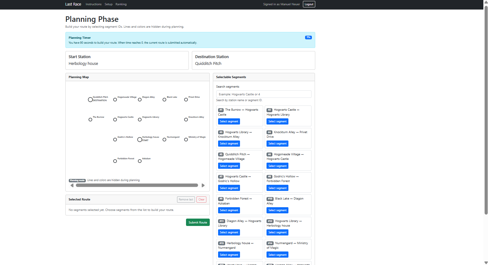
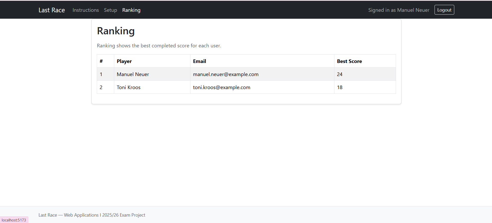

# Exam #1: "Last Race"

## Student: s357966 EL KHOURY EDDY

## React Client Application Routes

* Route `/`: this is the public instructions page. It explains the idea of the game and what the player has to do.
* Route `/login`: login page for registered users.
* Route `/setup`: protected page shown after login. Here the user can see the full underground network with stations, lines, connections, and colors before starting a game.
* Route `/game/:gameId/planning`: planning page for a specific game. The parameter `gameId` is the id of the game created by the server. In this page the user sees the start station, destination station, timer, station-only map, selectable segments, and selected route.
* Route `/game/:gameId/execution`: execution page for a specific game. It shows the route execution step by step after a valid route is submitted.
* Route `/game/:gameId/result`: result page for a specific game. It shows the final score and the completed game information.
* Route `/ranking`: protected ranking page. It shows the best completed score for each user.
* Route `/error`: generic error page.
* Route `*`: fallback route for unknown URLs.

Anonymous users can only access `/` and `/login`. The game pages and ranking are protected and redirect the user to `/login` if they are not authenticated.

## API Server

### Authentication APIs

* POST `/api/sessions`

  * request body:

    ```json
    {
      "email": "manuel.neuer@example.com",
      "password": "password"
    }
    ```
  * response body:

    ```json
    {
      "id": 1,
      "email": "manuel.neuer@example.com",
      "name": "Manuel Neuer"
    }
    ```
  * This API logs in the user and creates a session cookie.

* GET `/api/sessions/current`

  * request parameters: none
  * response body:

    ```json
    {
      "id": 1,
      "email": "manuel.neuer@example.com",
      "name": "Manuel Neuer"
    }
    ```
  * This API checks if the user is already logged in.

* DELETE `/api/sessions/current`

  * request parameters: none
  * response body:

    ```json
    {
      "message": "Logged out"
    }
    ```
  * This API logs out the current user.

### Game APIs

All the following APIs are protected and require login.

* GET `/api/network/full`

  * request parameters: none
  * response body: the full network with stations, lines, line colors, ordered line stations, and segments.
  * This is used in the setup phase, where the player is allowed to see the full map.

* POST `/api/games`

  * request body: none
  * response body: the newly created game, including the assigned start station and destination station.
  * The server creates the game and randomly chooses the start and destination. The client does not choose them.

* GET `/api/games/:id/planning`

  * request parameter:

    * `id`: game id
  * response body: planning data for the game, including stations, start/destination information, and selectable segments.
  * This API hides line names, line colors, and line IDs, because the planning phase must not reveal line information.

* POST `/api/games/:id/route`

  * request parameter:

    * `id`: game id
  * request body:

    ```json
    {
      "segments": [4, 3, 2, 6, 5]
    }
    ```
  * response body: whether the route is valid or not, the reason, final score, and step count.
  * The client sends only the selected segment IDs. The server reconstructs the route, validates it, applies events, and computes the score.

* GET `/api/games/:id`

  * request parameter:

    * `id`: game id
  * response body: information about one game belonging to the logged-in user.
  * This is used mainly by the result page.

* GET `/api/games/:id/steps`

  * request parameter:

    * `id`: game id
  * response body: the execution steps of a completed valid game.
  * Each step includes the from/to stations, line, event, event effect, and coin change.

* GET `/api/ranking`

  * request parameters: none
  * response body: the best completed score for each user.
  * The ranking is computed by the server, not by the client.

## Database Tables

* Table `user` - stores registered users. It contains the user id, email, name, password hash, and salt. Passwords are not stored in plain text.

* Table `station` - stores the underground stations. It also stores `x` and `y` coordinates, which are used to draw the SVG map in React.

* Table `line` - stores the metro lines, including their names and colors.

* Table `line_station` - stores the ordered stations for each metro line. This is used to describe how every line is built.

* Table `segment` - stores the direct connection between two adjacent stations on one line. During planning, the client submits these segment ids.

* Table `event` - stores the random events that can happen during execution. Each event has a description and a coin effect between `-4` and `+4`.

* Table `game` - stores each game. It includes the user, start station, destination station, status, initial coins, final score, submitted route, and timestamps.

* Table `game_step` - stores the steps of a valid executed route. Each step stores the movement, line, random event, and coin values before and after the step.

## Main React Components

* `App` (in `App.jsx`): main component of the client. It manages the login state, checks the current session, provides `UserContext`, and defines the routes.
* `Header` (in `Header.jsx`): navigation bar. It shows different links depending on whether the user is logged in.
* `Footer` (in `Footer.jsx`): simple footer used in the app layout.
* `LoginForm` (in `LoginForm.jsx`): login form with email and password fields.
* `InstructionsPage` (in `InstructionsPage.jsx`): public page that explains the game.
* `SetupPage` (in `SetupPage.jsx`): shows the full network map and lets the user start a game.
* `PlanningPage` (in `PlanningPage.jsx`): handles the planning phase, selected route, 90-second timer, and route submission.
* `ExecutionPage` (in `ExecutionPage.jsx`): shows the execution steps one by one.
* `ResultPage` (in `ResultPage.jsx`): shows the final score and game result.
* `RankingPage` (in `RankingPage.jsx`): shows the best score per user.
* `NetworkMap` (in `NetworkMap.jsx`): reusable SVG map. In setup mode it shows the full colored network, while in planning mode it hides the lines and only shows stations.
* `SegmentList` (in `SegmentList.jsx`): shows the selectable segments during planning.
* `SelectedRoute` (in `SelectedRoute.jsx`): shows the selected route in order and allows removing the last segment or clearing the route.
* `Timer` (in `Timer.jsx`): shows the remaining planning time.
* `GameStepCard` (in `GameStepCard.jsx`): shows one execution step with event and coin information.
* `Loading` (in `Loading.jsx`): reusable loading spinner.
* `ErrorPage` (in `ErrorPage.jsx`): displayed for unknown or invalid pages.

## Screenshot

### Setup phase with full network map



### Planning phase with timer and station-only map



### Ranking page



## Users Credentials

* [manuel.neuer@example.com](mailto:manuel.neuer@example.com), password
* [toni.kroos@example.com](mailto:toni.kroos@example.com), password
* [thomas.muller@example.com](mailto:thomas.muller@example.com), password

## Use of AI Tools

I used ChatGPT as an assistant and debugger during the project. It helped me split the work into sections, keep track of what I had already completed, and plan what still needed to be done. After finishing each section, I updated an MD file with the completed work, files changed, tests done, and next steps, so the project could continue in an organized way. ChatGPT also helped me debug code, understand errors, think of possible test cases, and check edge cases.
